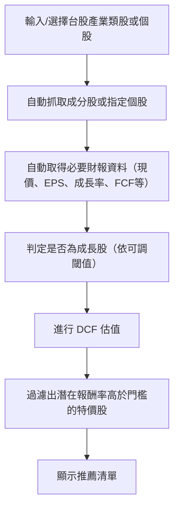

# 台股類股篩選 + 左側折現特價股篩選 專案需求（極簡版）

---
## 需求追蹤規則

- 本文件所有需求皆以 Markdown checkbox (`- [ ]`/`- [x]`) 條列，完成後請於方框內打勾，確保進度透明可追蹤。

---

## 0. 專案目標（明確版）

- 以「現金流折現法（DCF）」自動計算台股各產業類股與自選個股的合理價值。
- 所有估值流程皆以 DCF 為唯一核心邏輯，不再參考 Excel 工具。
- 自動抓取財報資料（現價、EPS、成長率、自由現金流等）作為估值依據。
- 增加「成長股判定」步驟，僅對符合成長條件（可調整閾值）的股票進行 DCF 估值。
- 過濾出「潛在獲利率」高於門檻（如50%）的便宜特價股，推薦給一般投資人。
- 幫助用戶「買在合理價」，降低追高風險，實踐價值投資。
- 流程極簡，單一頁面操作，適合一般投資人。
- 公式、參數透明，讓用戶理解選股邏輯。
- 可後續擴充批次匯出、進階參數調整等功能。

---

## 一、開發流程簡圖

---

## 二、需求清單（以 checkbox 管理）

### 1. 基本功能
- [x] 台股產業類股選擇（如電子、金融、傳產等）
- [x] 自動取得該類股所有成分股清單
- [x] 自動抓取每檔股票的現價、EPS、成長率、自由現金流等財報資料
- [x] 設定最低潛在報酬率門檻（如50%）
- [x] 過濾並顯示符合條件的特價股推薦清單
- [ ] **自選股估值模式**
    - [ ] 允許使用者輸入單一股票代號進行 DCF 估值
    - [ ] 調整 UI 以支援個股輸入與結果展示
    - [ ] 擴充狀態機與資料處理邏輯以支援個股估值流程
- [ ] **成長股判定機制**
    - [ ] 採用「預設智能閾值」自動判定成長股（如：近3年營收CAGR > 15%、EPS CAGR > 15%、ROE > 15% 等，具體數值於UI明示，可微調）
    - [ ] UI 提供多項成長指標勾選（checkbox），並可用 AND/OR 邏輯組合
    - [ ] 當數據不足時，於結果中標記「數據不足」或「N/A」並簡要說明
    - [ ] 僅對成長股進行 DCF 估值
    - [ ] 保留未來擴充自動閾值獲取方式（如行業/市場比較、歷史動態、ML推斷等）

### 2. 結果呈現
- [x] 表格顯示推薦清單（股票代號、名稱、現價、估值、潛在報酬率）
- [x] 一鍵匯出 CSV/Excel

### 3. 介面需求
- [x] 極簡GUI（單一頁面，操作直覺）
- [x] 採用 Streamlit，支援桌面與手機瀏覽器操作，快速開發、易於部署
- [ ] **中英文語言切換**
    - [ ] UI 支援中英文切換，所有介面文字可切換語言

### 4. 非功能性需求
- [ ] **系統穩定性**
    - [ ] 進行全面的端對端測試，涵蓋各種邊界條件與錯誤情境。
    - [ ] 增強應用程式的錯誤處理機制，提供更友好的錯誤提示。
- [ ] **易用性與維護性**
    - [ ] 優化日誌記錄，確保關鍵操作與錯誤能被有效追蹤。
    - [ ] 提供手動清理暫存資料（如 cache/ 目錄）功能

### 5. 技術探索
- [ ] **XBRL 技術預研**
    - [ ] 驗證 Python 函式庫解析 XBRL 財報的能力。
    - [ ] 初步評估直接從 XBRL 源獲取數據相對於目前 API 方式的優劣、風險與可行性。

---

## 額外說明
- 本專案主要針對「台股類股」批次篩選左側折現特價股，並已規劃加入「自選股估值」模式。流程力求極簡，適合一般投資人。
- 主要操作：選產業/輸入個股→自動估值→顯示推薦→（可選）匯出清單。
- 其他進階功能（技術指標、狀態監控、Docker等）暫不納入，後續可視需求擴充。
- 所有需求皆以 checkbox 管理，完成後請於方框內打勾。

---

如需再精簡或補充細節，請隨時告知！
