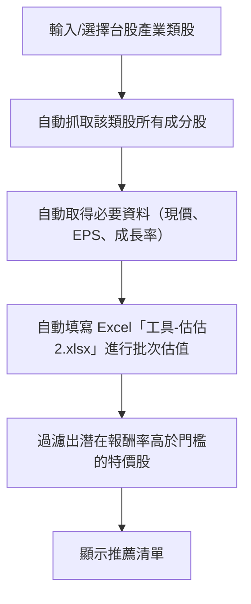

# 台股類股篩選 + 左側折現特價股篩選 專案需求（極簡版）

---

## 一、開發流程簡圖

---

## 二、需求清單（極簡）

### 1. 基本功能
- [x] 台股產業類股選擇（如電子、金融、傳產等）
- [x] 自動取得該類股所有成分股清單
- [x] 自動抓取每檔股票的現價、EPS、成長率
- [x] 自動填寫 Excel「工具-估估2.xlsx」進行批次估值
- [x] 設定最低潛在報酬率門檻（如50%）
- [x] 過濾並顯示符合條件的特價股推薦清單

### 2. 結果呈現
- [x] 表格顯示推薦清單（股票代號、名稱、現價、估值、潛在報酬率）
- [ ] 匯出 CSV/Excel（可選）

### 3. 介面需求
- [x] 極簡GUI（單一頁面，操作直覺）

---

## 額外說明
- 本專案僅針對「台股類股」批次篩選左側折現特價股，流程極簡，適合一般投資人。
- 主要操作：選產業→自動估值→顯示推薦→（可選）匯出清單。
- 其他進階功能（自選股、技術指標、狀態監控、Docker等）暫不納入，後續可視需求擴充。

---

如需再精簡或補充細節，請隨時告知！
