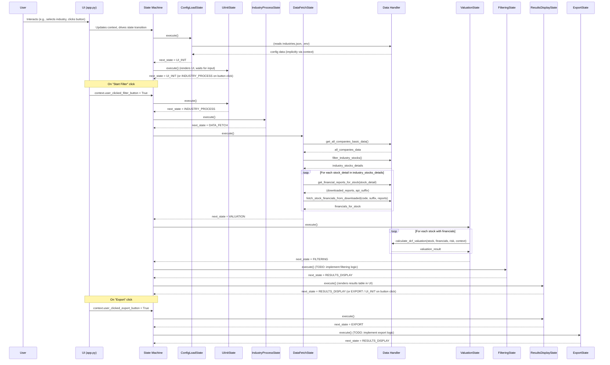

# JoJoTrading (Streamlit Version) - Architecture Diagram

## 1. Class and Module Diagram

```mermaid
classDiagram
    direction LR

    package "jojo_state_machine.py" {
        class JoJoState {
            <<enumeration>>
            CONFIG_LOAD
            UI_INIT
            INDUSTRY_PROCESS
            DATA_FETCH
            VALUATION
            FILTERING
            RESULTS_DISPLAY
            EXPORT
            ERROR
            END
        }

        class BaseState {
            <<Abstract>>
            +execute(context) JoJoState
            +on_enter(context) void
            +on_exit(context) void
        }

        class ConfigLoadState
        class UiInitState
        class IndustryProcessState
        class DataFetchState
        class ValuationState
        class FilteringState
        class ResultsDisplayState
        class ExportState
        class ErrorState
        class EndState

        ConfigLoadState --|> BaseState
        UiInitState --|> BaseState
        IndustryProcessState --|> BaseState
        DataFetchState --|> BaseState
        ValuationState --|> BaseState
        FilteringState --|> BaseState
        ResultsDisplayState --|> BaseState
        ExportState --|> BaseState
        ErrorState --|> BaseState
        EndState --|> BaseState

        class JoJoStateMachine {
            -current_jojo_state_enum JoJoState
            -context dict
            -states dict~JoJoState, BaseState~
            +run() void
            +__init__() void
        }
        JoJoStateMachine o-- JoJoState : "current state"
        JoJoStateMachine *-- BaseState : "manages state objects"
    }

    package "app.py" {
        class StreamlitApp {
            <<Streamlit Script>>
            -machine JoJoStateMachine
            +render_ui()
            +handle_user_interaction()
        }
    }
    StreamlitApp ..> JoJoStateMachine : creates & drives

    package "data_handler.py" {
        class DataHandlerModule {
            <<Module>>
            +get_all_companies_basic_data(context) list
            +filter_industry_stocks(selected_industry_name, name_to_code_map, all_companies_data) list
            +get_financial_reports_for_stock(stock_detail, context) tuple
            +fetch_stock_financials_from_downloaded(stock_code, api_suffix, downloaded_reports) dict
            +calculate_dcf_valuation(stock_code, financials, risk_preference, context) dict
        }
    }
    DataFetchState ..> DataHandlerModule : uses functions from
    ValuationState ..> DataHandlerModule : uses functions from
    ConfigLoadState ..> DataHandlerModule : (implicitly, for industries.json)


    package "Configuration" {
        class industries_json {
            <<JSON File>>
            industries: list
            default_risk_premium: float
            risk_premium_options: dict
        }
        class env_file {
            <<.env File>>
            API_KEY_XXX (example)
        }
    }
    ConfigLoadState ..> industries_json : reads
    ConfigLoadState ..> env_file : reads (via dotenv)
    
    note for DataHandlerModule "Contains functions for API interaction and data processing."
    note for StreamlitApp "Main Streamlit application script that orchestrates UI and state machine."
```

## 2. Data Flow / Interaction Overview (Sequence Diagram)



This updated diagram attempts to show the main Python files/modules (`jojo_state_machine.py`, `app.py`, `data_handler.py`) as packages containing their respective classes or representing a collection of functions. It also includes configuration files.
