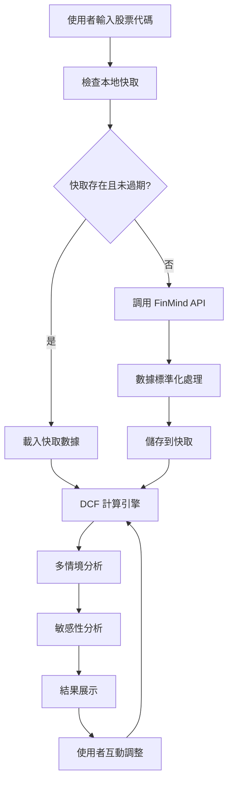
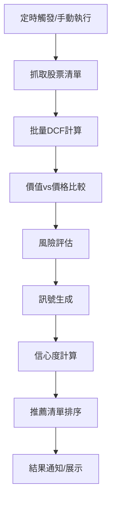

# JoJo Trading System 技術架構說明

## 系統架構總覽 🏗️

```
┌─────────────────────────────────────────────────────────────────┐
│                    JoJo Trading System                         │
├─────────────────────────────────────────────────────────────────┤
│                  Presentation Layer (UI)                       │
│  ┌─────────────────┐  ┌─────────────────┐  ┌─────────────────┐  │
│  │   Streamlit     │  │   Web Pages     │  │   Components    │  │
│  │   Main App      │  │   DCF Analysis  │  │   Charts/Forms  │  │
│  └─────────────────┘  └─────────────────┘  └─────────────────┘  │
├─────────────────────────────────────────────────────────────────┤
│                   Business Logic Layer                         │
│  ┌─────────────────┐  ┌─────────────────┐  ┌─────────────────┐  │
│  │  DCF Calculator │  │ Trading System  │  │  Risk Manager   │  │
│  │   Core Engine   │  │   Signals Gen   │  │   Portfolio     │  │
│  └─────────────────┘  └─────────────────┘  └─────────────────┘  │
├─────────────────────────────────────────────────────────────────┤
│                    Data Access Layer                           │
│  ┌─────────────────┐  ┌─────────────────┐  ┌─────────────────┐  │
│  │  Data Fetcher   │  │   Cache Mgr     │  │  Data Processor │  │
│  │   FinMind API   │  │   Local Cache   │  │   Standardizer  │  │
│  └─────────────────┘  └─────────────────┘  └─────────────────┘  │
├─────────────────────────────────────────────────────────────────┤
│                   External Services                            │
│  ┌─────────────────┐  ┌─────────────────┐  ┌─────────────────┐  │
│  │   FinMind API   │  │     TWSE        │  │  Yahoo Finance  │  │
│  │   財務數據       │  │   官方數據       │  │   股價補充       │  │
│  └─────────────────┘  └─────────────────┘  └─────────────────┘  │
└─────────────────────────────────────────────────────────────────┘
```

## 核心模組架構詳解

### 1. 展示層 (Presentation Layer)

#### Streamlit 應用框架
```python
# 主應用結構
main_app.py
├── 頁面路由管理
├── 全域狀態管理  
├── 使用者認證 (未來)
└── 錯誤處理展示

pages/
├── dcf_analysis.py     # DCF 分析頁面
├── trading_system.py   # 交易系統頁面
└── portfolio.py        # 投資組合頁面 (未來)
```

#### UI 組件架構
- **圖表組件**: Plotly + Streamlit 整合
- **表單組件**: Streamlit 原生組件
- **數據展示**: DataFrame + 格式化
- **互動控制**: Sidebar + 參數調整

### 2. 業務邏輯層 (Business Logic)

#### DCF 計算引擎
```python
# DCF 核心計算流程
DCF_Calculator
├── 財務數據驗證
├── 自由現金流計算
│   ├── 營運現金流
│   ├── 資本支出
│   └── 營運資金變化
├── WACC 計算
│   ├── 權益成本 (CAPM)
│   ├── 債務成本
│   └── 資本結構權重
├── 終值計算
│   ├── Gordon Growth Model
│   ├── Exit Multiple (未來)
│   └── 殘值分析
└── 情境分析
    ├── 樂觀情境 (+20%)
    ├── 保守情境 (-20%)
    └── 中性情境 (基準)
```

#### 交易系統架構
```python
# 交易訊號生成流程
Trading_System
├── 價值評估
│   ├── DCF 內在價值
│   ├── 市場價格比較
│   └── 安全邊際計算
├── 訊號生成
│   ├── BUY: 折價 > 20%
│   ├── SELL: 溢價 > 15%  
│   └── HOLD: 其他情況
├── 風險控制
│   ├── 部位大小控制
│   ├── 停損點設定
│   └── 分散度檢查
└── 執行管理
    ├── 訂單生成 (未來)
    ├── 執行確認 (未來)
    └── 績效追蹤
```

### 3. 資料存取層 (Data Access)

#### 資料抓取架構
```python
# 多源數據整合
Data_Fetcher
├── FinMind_Client
│   ├── 財務報表
│   ├── 股價數據
│   ├── 除權息資訊
│   └── 總體經濟數據
├── TWSE_Scraper
│   ├── 股本變化
│   ├── 公司基本資料
│   └── 即時股價
├── Yahoo_Finance (補充)
│   ├── 歷史股價
│   ├── 技術指標
│   └── 國際數據
└── Data_Standardizer
    ├── 格式統一
    ├── 缺失值處理
    └── 異常值檢測
```

#### 快取系統架構
```python
# 分層快取策略
Cache_Manager
├── Level 1: 記憶體快取
│   ├── 當前會話數據
│   ├── 計算結果暫存
│   └── 配置參數
├── Level 2: 本地檔案快取
│   ├── 財務報表 (每日更新)
│   ├── 股價數據 (實時更新)
│   └── 計算結果 (按需更新)
└── Cache_Strategy
    ├── TTL (Time To Live)
    ├── LRU (Least Recently Used)
    └── 依賴更新 (Dependency Update)
```

## 資料流程詳解

### 1. DCF 分析流程


### 2. 交易訊號生成流程


## 技術棧詳細說明

### 核心技術棧
| 層級 | 技術 | 版本 | 用途 | 替代方案 |
|------|------|------|------|----------|
| 前端 | Streamlit | 1.28+ | Web UI 框架 | Flask, Django |
| 後端 | Python | 3.8+ | 主要開發語言 | - |
| 數據處理 | pandas | 1.5+ | 數據操作 | NumPy, Polars |
| 數值計算 | NumPy | 1.21+ | 科學計算 | SciPy |
| 圖表 | Plotly | 5.0+ | 互動圖表 | Matplotlib |
| HTTP | requests | 2.28+ | API 調用 | httpx, aiohttp |
| 解析 | lxml | 4.9+ | XML/HTML 解析 | BeautifulSoup |

### 開發與測試工具
| 用途 | 工具 | 版本 | 說明 |
|------|------|------|------|
| 測試框架 | pytest | 7.0+ | 單元/整合測試 |
| 覆蓋率 | pytest-cov | 4.0+ | 測試覆蓋分析 |
| 代碼格式 | black | 22.0+ | 代碼格式化 |
| 靜態分析 | flake8 | 5.0+ | 代碼品質檢查 |
| 依賴管理 | pip | 22.0+ | 套件管理 |

## 設計模式與原則

### 採用的設計模式
1. **MVC 模式**: 清楚分離展示層、業務邏輯、數據存取
2. **策略模式**: DCF 計算支援多種估值策略
3. **觀察者模式**: 數據更新時自動通知相關組件
4. **工廠模式**: 不同數據源的統一創建介面
5. **快取模式**: 多層快取提升效能

### 設計原則
- **單一職責**: 每個模組專注特定功能
- **開放封閉**: 易於擴展新功能，修改風險低
- **依賴反轉**: 高層模組不依賴低層實作細節
- **介面隔離**: 客戶端不依賴不需要的介面
- **DRY原則**: 避免重複代碼

## 效能考量與優化

### 效能瓶頸點
1. **API 調用延遲**: FinMind API 響應時間 1-3 秒
2. **數據處理**: 大量財務數據計算消耗 CPU
3. **記憶體使用**: 多公司數據同時載入
4. **UI 渲染**: Streamlit 組件重新渲染

### 優化策略
```python
# 效能優化實作範例

# 1. 數據快取
@lru_cache(maxsize=100)
def get_financial_data(symbol, date_range):
    """快取財務數據，避免重複API調用"""
    pass

# 2. 批量處理
def batch_dcf_calculation(symbols):
    """批量計算提升效率"""
    with ThreadPoolExecutor(max_workers=5) as executor:
        futures = [executor.submit(calculate_dcf, symbol) 
                  for symbol in symbols]
    return [f.result() for f in futures]

# 3. lazy loading
@st.cache_data
def load_company_list():
    """延遲載入公司清單"""
    pass

# 4. 數據壓縮
def compress_cache_data(data):
    """壓縮快取數據節省空間"""
    return pickle.dumps(data, protocol=pickle.HIGHEST_PROTOCOL)
```

## 安全性考量

### 資料安全
- **API 金鑰管理**: 環境變數存儲，不寫入代碼
- **數據驗證**: 輸入數據格式與範圍檢查
- **錯誤處理**: 避免敏感資訊洩露
- **快取清理**: 定期清理過期敏感數據

### 應用安全
- **輸入驗證**: 防止 SQL 注入、XSS 攻擊
- **權限控制**: 未來版本加入使用者認證
- **日誌安全**: 避免記錄敏感資訊
- **網路安全**: HTTPS 通訊，API 限流

## 可擴展性設計

### 橫向擴展
- **微服務架構**: 可拆分為獨立服務
- **負載均衡**: 支援多實例部署
- **資料庫分片**: 大量數據水平分割
- **CDN 加速**: 靜態資源分發

### 功能擴展
- **新估值方法**: 策略模式易於新增
- **多市場支援**: 數據抓取層模組化
- **機器學習**: 預留 ML 模組介面
- **即時交易**: 交易系統架構支援

## 部署架構

### 開發環境
```yaml
# 本地開發環境
Local Development:
  - Python 3.8+ virtual environment
  - Git version control
  - Local file cache
  - SQLite for metadata (future)
```

### 測試環境
```yaml
# 測試環境
Testing Environment:
  - Docker containers
  - Automated testing pipeline
  - Mock external APIs
  - Test data isolation
```

### 生產環境 (規劃)
```yaml
# 生產環境規劃
Production Environment:
  - Docker + Kubernetes
  - Redis for caching
  - PostgreSQL for persistence
  - Load balancer
  - Monitoring & Logging
```

## 監控與日誌

### 應用監控
- **效能指標**: 響應時間、吞吐量、錯誤率
- **業務指標**: DCF 計算次數、API 調用統計
- **系統指標**: CPU、記憶體、磁碟使用率
- **使用者行為**: 頁面訪問、功能使用統計

### 日誌架構
```python
# 日誌分層架構
Logger_Architecture:
  - Application Logs: 業務邏輯日誌
  - Error Logs: 錯誤與異常追蹤
  - Performance Logs: 效能分析數據
  - Audit Logs: 重要操作記錄
  - Debug Logs: 開發除錯資訊
```

---

**架構文檔版本**: v1.0  
**最後更新**: 2025-06-13  
**架構師**: AI 開發團隊  
**審查狀態**: ✅ 已完成初版，持續優化中

## 附錄

### A. 相關文檔
- `MODULE_ARCHITECTURE_GUIDE.md`: 模組設計詳解
- `API_DOCUMENTATION.md`: API 介面文檔
- `DATABASE_SCHEMA.md`: 數據庫設計 (未來)

### B. 架構決策記錄 (ADR)
- ADR-001: 選擇 Streamlit 作為 Web 框架
- ADR-002: 採用分層架構設計
- ADR-003: 使用本地檔案快取策略

### C. 技術債務追蹤
- TD-001: 缺少統一的例外處理機制
- TD-002: 測試覆蓋率需要提升至 80%+
- TD-003: 需要實作配置管理系統
