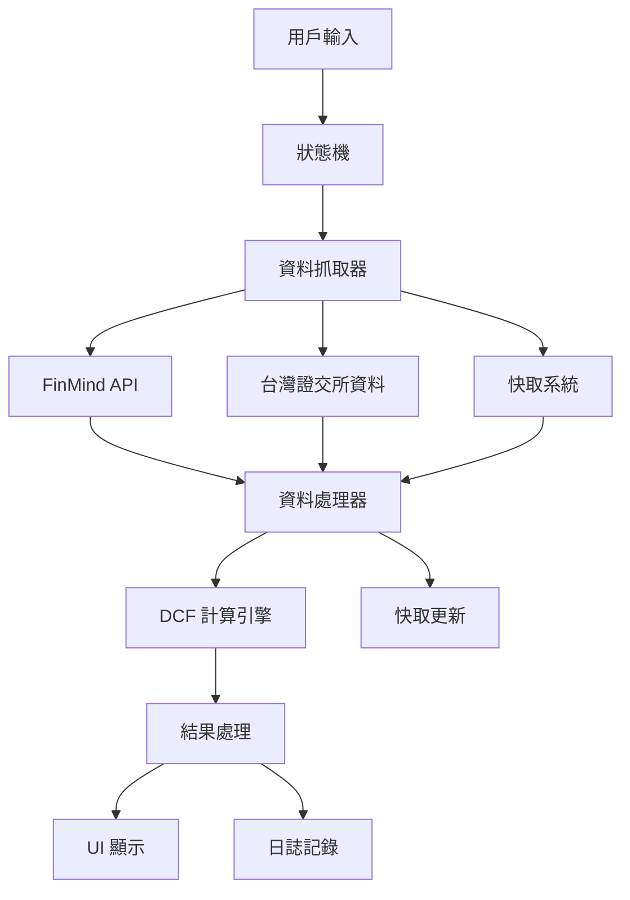

# 🔧 JoJo Trading 技術文檔

> **系統架構、API 參考、故障排除的技術指南**

---

## 📋 技術文檔索引

| 文檔類型 | 內容 | 適用對象 |
|----------|------|----------|
| **🏗️ 系統架構** | 模組設計、資料流、狀態管理 | 開發者、架構師 |
| **📡 API 參考** | 內部 API、外部整合、資料格式 | 開發者、整合者 |
| **🔍 故障排除** | 常見問題、診斷工具、修復方案 | 維護者、使用者 |
| **⚡ 效能調優** | 快取策略、資料庫優化、記憶體管理 | 開發者、維運者 |

---

## 🏗️ 系統架構技術規格

### 📦 核心模組架構

```python
# 系統架構概覽
src/jojo_trading/
├── core/                     # 🧠 核心業務邏輯層
│   ├── state_machine.py      # 狀態機流程控制
│   ├── dcf_calculator.py     # DCF 計算引擎
│   ├── enhanced_dcf.py       # 增強版 DCF 模型
│   ├── auto_data_fetcher.py  # 自動資料抓取器
│   ├── data_handler.py       # 資料處理引擎
│   └── integrated_dcf_handler.py # DCF 整合處理器
│
├── ui/                       # 🎨 使用者介面層
│   ├── app.py               # 主應用程式
│   ├── components/          # UI 組件
│   │   ├── individual_dcf.py      # 個股 DCF 分析
│   │   ├── enhanced_individual_dcf.py # 增強版個股分析
│   │   ├── sector_screening.py    # 類股篩選
│   │   └── common_widgets.py      # 通用 UI 組件
│   └── pages/               # 多頁面管理
│
├── config/                  # ⚙️ 配置管理層
│   ├── settings.py          # 系統設定
│   ├── constants.py         # 常數定義
│   └── validation.py        # 資料驗證
│
└── utils/                   # 🔧 工具函數層
    ├── logger.py            # 日誌管理
    ├── cache_manager.py     # 快取管理
    └── helpers.py           # 輔助函數
```

### 🔄 資料流架構



### 🔀 狀態機設計

```python
# 狀態機狀態定義
class AppState(Enum):
    INIT = "初始化"
    CONFIG_LOAD = "配置載入"
    UI_INIT = "介面初始化"
    IDLE = "等待操作"
    DATA_FETCH = "資料抓取"
    CALCULATION = "計算處理"
    DISPLAY = "結果顯示"
    ERROR = "錯誤處理"

# 狀態轉換規則
TRANSITIONS = {
    AppState.INIT: [AppState.CONFIG_LOAD, AppState.ERROR],
    AppState.CONFIG_LOAD: [AppState.UI_INIT, AppState.ERROR],
    AppState.UI_INIT: [AppState.IDLE, AppState.ERROR],
    AppState.IDLE: [AppState.DATA_FETCH, AppState.ERROR],
    AppState.DATA_FETCH: [AppState.CALCULATION, AppState.IDLE, AppState.ERROR],
    AppState.CALCULATION: [AppState.DISPLAY, AppState.ERROR],
    AppState.DISPLAY: [AppState.IDLE, AppState.ERROR],
    AppState.ERROR: [AppState.INIT, AppState.IDLE]
}
```

---

## 📡 API 參考文檔

### 🔌 核心 API 介面

#### DCF 計算 API

```python
class DCFCalculator:
    def calculate_dcf(
        self, 
        fcf_projections: List[float],  # 自由現金流預測
        wacc: float,                   # 加權平均資本成本
        terminal_growth: float,        # 永續成長率
        shares_outstanding: float      # 流通股數
    ) -> Dict[str, Any]:
        """
        計算 DCF 估值
        
        Returns:
        {
            'dcf_value': float,        # DCF 估值
            'intrinsic_value': float,  # 每股內在價值
            'pv_fcf': List[float],     # 現金流現值
            'terminal_value': float,   # 終值
            'confidence': float        # 信心指數
        }
        """
```

#### 資料抓取 API

```python
class AutoDataFetcher:
    def get_dcf_data(self, stock_code: str) -> Dict[str, Any]:
        """
        自動抓取 DCF 分析所需資料
        
        Args:
            stock_code: 股票代碼 (如 '2330')
            
        Returns:
        {
            'success': bool,
            'data': {
                'company_name': str,
                'current_market_price': float,
                'net_income_parent': float,
                'shares_outstanding': float,
                'capex': float,
                'depreciation': float,
                'total_revenue': float,
                'data_quality_score': float
            },
            'data_sources': Dict[str, str],
            'last_updated': str
        }
        """
```

### 🌐 外部 API 整合

#### FinMind API 整合

```python
# API 端點配置
FINMIND_ENDPOINTS = {
    'price': 'https://api.finmindtrade.com/api/v4/data',
    'financial': 'https://api.finmindtrade.com/api/v4/data',
    'basic': 'https://api.finmindtrade.com/api/v4/data'
}

# API 請求參數
def get_stock_price(stock_code: str, start_date: str, end_date: str):
    params = {
        'dataset': 'TaiwanStockPrice',
        'data_id': stock_code,
        'start_date': start_date,
        'end_date': end_date,
        'token': os.getenv('FINMIND_TOKEN')
    }
```

#### 台灣證交所 API

```python
# 公開資訊觀測站整合
TWSE_ENDPOINTS = {
    'company_basic': 'https://mops.twse.com.tw/mops/web/ajax_t163sb04',
    'financial_statement': 'https://mops.twse.com.tw/mops/web/ajax_t163sb05'
}
```

### 📊 資料格式規範

#### 標準回應格式

```python
# 統一回應格式
class APIResponse:
    success: bool              # 操作成功狀態
    data: Dict[str, Any]      # 實際資料
    error: Optional[str]      # 錯誤訊息
    metadata: Dict[str, Any]  # 元資料 (來源、時間戳等)
    
# 錯誤回應格式
class APIError:
    error_code: str           # 錯誤代碼
    error_message: str        # 錯誤描述
    error_details: Dict       # 詳細錯誤資訊
    timestamp: str            # 錯誤時間
```

---

## 🔍 故障排除指南

### ❌ 常見錯誤分類

#### 1. **模組導入錯誤**

```python
# 錯誤: ModuleNotFoundError: No module named 'jojo_trading'
# 原因: Python 路徑配置問題
# 解決:
import sys
import os
sys.path.append(os.path.join(os.path.dirname(__file__), 'src'))

# 或設定環境變數
export PYTHONPATH="${PYTHONPATH}:/path/to/jojo_trading/src"
```

#### 2. **API 連線錯誤**

```python
# 錯誤: requests.exceptions.ConnectionError
# 原因: 網路連線或 API 端點問題
# 診斷:
def diagnose_api_connection():
    import requests
    import time
    
    endpoints = [
        'https://api.finmindtrade.com/api/v4/data',
        'https://mops.twse.com.tw'
    ]
    
    for endpoint in endpoints:
        try:
            start_time = time.time()
            response = requests.get(endpoint, timeout=10)
            latency = time.time() - start_time
            
            print(f"✅ {endpoint}: {response.status_code} ({latency:.2f}s)")
        except Exception as e:
            print(f"❌ {endpoint}: {str(e)}")
```

#### 3. **記憶體不足錯誤**

```python
# 錯誤: MemoryError
# 原因: 大量資料載入或快取溢出
# 解決:
import gc
import psutil

def memory_monitor():
    memory = psutil.virtual_memory()
    print(f"記憶體使用率: {memory.percent}%")
    
    if memory.percent > 80:
        gc.collect()  # 強制垃圾回收
        clear_cache()  # 清除快取
```

#### 4. **資料格式錯誤**

```python
# 錯誤: KeyError, ValueError, TypeError
# 原因: API 回傳資料格式不符預期
# 解決:
def safe_data_extraction(data, key, default=None):
    try:
        return data.get(key, default) if isinstance(data, dict) else default
    except (AttributeError, TypeError):
        return default

# 使用範例
shares_outstanding = safe_data_extraction(
    company_data, 
    'shares_outstanding', 
    default=100_000_000  # 預設值
)
```

### 🛠️ 診斷工具

#### 系統診斷腳本

```python
# scripts/system_diagnosis.py
def system_diagnosis():
    """完整系統診斷"""
    
    # 1. Python 環境檢查
    check_python_environment()
    
    # 2. 依賴套件檢查
    check_dependencies()
    
    # 3. 網路連線檢查
    check_network_connectivity()
    
    # 4. 資料庫連線檢查
    check_database_connection()
    
    # 5. 快取系統檢查
    check_cache_system()
    
    # 6. 記憶體使用檢查
    check_memory_usage()

def check_python_environment():
    import sys
    print(f"Python 版本: {sys.version}")
    print(f"Python 路徑: {sys.executable}")
    print(f"模組搜尋路徑: {sys.path}")

def check_dependencies():
    import pkg_resources
    
    required_packages = [
        'streamlit>=1.45.0',
        'pandas>=1.5.0',
        'numpy>=1.21.0',
        'requests>=2.25.0',
        'finmind>=1.0.0'
    ]
    
    for package in required_packages:
        try:
            pkg_resources.require(package)
            print(f"✅ {package}")
        except pkg_resources.DistributionNotFound:
            print(f"❌ {package} - 未安裝")
        except pkg_resources.VersionConflict:
            print(f"⚠️ {package} - 版本不符")
```

#### 日誌分析工具

```python
# utils/log_analyzer.py
def analyze_logs(log_file='logs/jojo_trading_app.log'):
    """分析應用程式日誌"""
    
    error_patterns = [
        r'ERROR.*',
        r'CRITICAL.*',
        r'Exception.*',
        r'Traceback.*'
    ]
    
    warning_patterns = [
        r'WARNING.*',
        r'WARN.*'
    ]
    
    with open(log_file, 'r', encoding='utf-8') as f:
        lines = f.readlines()
    
    errors = []
    warnings = []
    
    for line in lines:
        for pattern in error_patterns:
            if re.match(pattern, line):
                errors.append(line.strip())
                
        for pattern in warning_patterns:
            if re.match(pattern, line):
                warnings.append(line.strip())
    
    print(f"發現 {len(errors)} 個錯誤, {len(warnings)} 個警告")
    return errors, warnings
```

---

## ⚡ 效能調優指南

### 🚀 快取策略

#### Streamlit 快取優化

```python
import streamlit as st

# 資料快取 - 用於不常變動的資料
@st.cache_data(ttl=3600)  # 1小時快取
def load_company_basic_data():
    """載入公司基本資料 (快取1小時)"""
    return pd.read_json('data/all_companies_basic_data.json')

# 資源快取 - 用於計算密集的操作
@st.cache_resource
def initialize_dcf_calculator():
    """初始化 DCF 計算器 (全域單例)"""
    return DCFCalculator()

# 條件快取 - 根據參數動態快取
@st.cache_data
def calculate_dcf_with_params(
    stock_code: str,
    wacc: float,
    growth_rate: float,
    _dcf_calculator  # 前綴 _ 表示不參與快取鍵
):
    """根據參數快取 DCF 計算結果"""
    return _dcf_calculator.calculate(stock_code, wacc, growth_rate)
```

#### 自定義快取系統

```python
# utils/cache_manager.py
class CacheManager:
    def __init__(self, max_size=1000, ttl=3600):
        self.cache = {}
        self.max_size = max_size
        self.ttl = ttl  # Time to live in seconds
    
    def get(self, key):
        if key in self.cache:
            data, timestamp = self.cache[key]
            if time.time() - timestamp < self.ttl:
                return data
            else:
                del self.cache[key]  # 過期刪除
        return None
    
    def set(self, key, value):
        if len(self.cache) >= self.max_size:
            # LRU 淘汰策略
            oldest_key = min(self.cache.keys(), 
                           key=lambda k: self.cache[k][1])
            del self.cache[oldest_key]
        
        self.cache[key] = (value, time.time())

# 全域快取管理器
cache_manager = CacheManager(max_size=500, ttl=1800)
```

### 🗄️ 資料庫優化

#### 檔案 I/O 優化

```python
# 非同步檔案讀取
import asyncio
import aiofiles

async def load_data_async(file_path):
    """非同步載入大型資料檔案"""
    async with aiofiles.open(file_path, 'r') as f:
        data = await f.read()
        return json.loads(data)

# 分塊載入大型 DataFrame
def load_large_dataframe(file_path, chunk_size=10000):
    """分塊載入大型 CSV 檔案"""
    chunks = []
    for chunk in pd.read_csv(file_path, chunksize=chunk_size):
        # 對每個 chunk 進行處理
        processed_chunk = process_chunk(chunk)
        chunks.append(processed_chunk)
    
    return pd.concat(chunks, ignore_index=True)
```

#### 記憶體管理

```python
# 記憶體監控裝飾器
def memory_monitor(func):
    """監控函數記憶體使用情況"""
    import psutil
    import functools
    
    @functools.wraps(func)
    def wrapper(*args, **kwargs):
        process = psutil.Process()
        mem_before = process.memory_info().rss / 1024 / 1024  # MB
        
        result = func(*args, **kwargs)
        
        mem_after = process.memory_info().rss / 1024 / 1024
        mem_diff = mem_after - mem_before
        
        if mem_diff > 100:  # 記憶體增加超過 100MB 時警告
            print(f"⚠️ {func.__name__} 記憶體使用增加 {mem_diff:.1f}MB")
        
        return result
    return wrapper

# 記憶體清理工具
def memory_cleanup():
    """手動記憶體清理"""
    import gc
    
    # 強制垃圾回收
    collected = gc.collect()
    
    # 清除 Streamlit 快取
    st.cache_data.clear()
    st.cache_resource.clear()
    
    print(f"清理了 {collected} 個物件")
```

### 📊 效能監控

#### 效能指標收集

```python
# utils/performance_monitor.py
class PerformanceMonitor:
    def __init__(self):
        self.metrics = {}
    
    def start_timer(self, operation_name):
        """開始計時"""
        self.metrics[operation_name] = {
            'start_time': time.time(),
            'memory_start': self._get_memory_usage()
        }
    
    def end_timer(self, operation_name):
        """結束計時並記錄指標"""
        if operation_name in self.metrics:
            metric = self.metrics[operation_name]
            metric['duration'] = time.time() - metric['start_time']
            metric['memory_end'] = self._get_memory_usage()
            metric['memory_diff'] = metric['memory_end'] - metric['memory_start']
    
    def _get_memory_usage(self):
        """獲取當前記憶體使用量"""
        import psutil
        return psutil.Process().memory_info().rss / 1024 / 1024

    def get_report(self):
        """生成效能報告"""
        report = []
        for operation, metrics in self.metrics.items():
            if 'duration' in metrics:
                report.append({
                    'operation': operation,
                    'duration': f"{metrics['duration']:.3f}s",
                    'memory_change': f"{metrics['memory_diff']:.1f}MB"
                })
        return report

# 全域效能監控器
perf_monitor = PerformanceMonitor()
```

---

## 🔐 安全性考量

### 🛡️ API 安全

```python
# 安全的 API 金鑰管理
import os
from cryptography.fernet import Fernet

class SecureConfig:
    def __init__(self):
        self.cipher_suite = Fernet(os.getenv('ENCRYPTION_KEY'))
    
    def encrypt_api_key(self, api_key):
        """加密 API 金鑰"""
        return self.cipher_suite.encrypt(api_key.encode()).decode()
    
    def decrypt_api_key(self, encrypted_key):
        """解密 API 金鑰"""
        return self.cipher_suite.decrypt(encrypted_key.encode()).decode()

# 安全的環境變數讀取
def get_secure_env(key, default=None):
    """安全地讀取環境變數"""
    value = os.getenv(key, default)
    if value is None:
        raise ValueError(f"必須設定環境變數: {key}")
    return value
```

### 🚨 輸入驗證

```python
# 股票代碼驗證
def validate_stock_code(stock_code):
    """驗證台股股票代碼格式"""
    import re
    
    # 台股代碼格式: 4位數字
    pattern = r'^\d{4}$'
    
    if not re.match(pattern, stock_code):
        raise ValueError(f"無效的股票代碼格式: {stock_code}")
    
    # 檢查代碼範圍 (台股代碼範圍)
    code_num = int(stock_code)
    if not (1000 <= code_num <= 9999):
        raise ValueError(f"股票代碼超出範圍: {stock_code}")
    
    return stock_code

# DCF 參數驗證
def validate_dcf_params(wacc, growth_rate, years):
    """驗證 DCF 計算參數"""
    
    if not (0.01 <= wacc <= 0.30):  # 1% - 30%
        raise ValueError(f"WACC 應在 1%-30% 範圍內: {wacc:.2%}")
    
    if not (-0.05 <= growth_rate <= 0.20):  # -5% - 20%
        raise ValueError(f"成長率應在 -5%-20% 範圍內: {growth_rate:.2%}")
    
    if not (1 <= years <= 20):
        raise ValueError(f"預測年數應在 1-20 年範圍內: {years}")
    
    return True
```

---

*技術文檔最後更新: 2025年6月12日*  
*適用系統版本: v2.0 Enhanced DCF Analysis Platform*
