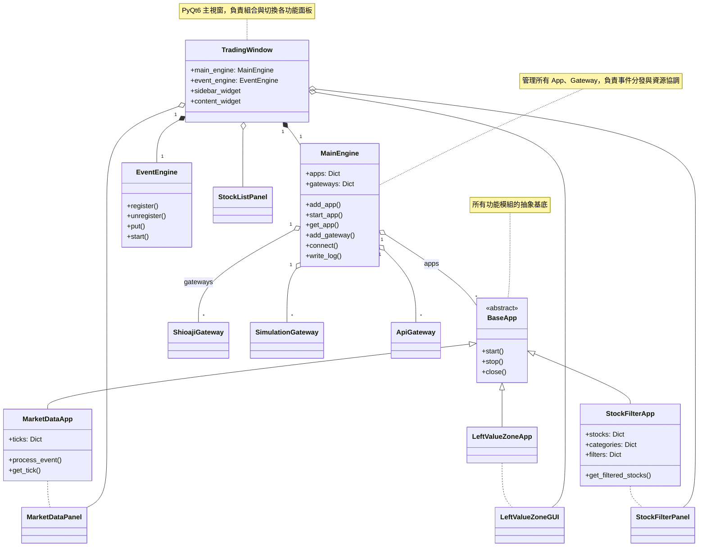

# JoJoTrading 類圖（Mermaid 語法）

> 本類圖涵蓋主架構、核心類別、主要 App 與 GUI 關聯，適合貼到 markdown 或用 mermaid.live/PlantUML 轉圖。

---

## 使用說明
- 可直接貼到 [mermaid.live](https://mermaid.live/) 產生圖形。
- 若需 PlantUML 版本或更細節的類圖，請告知。
- 可依需求擴充欄位、方法、模組。

---
