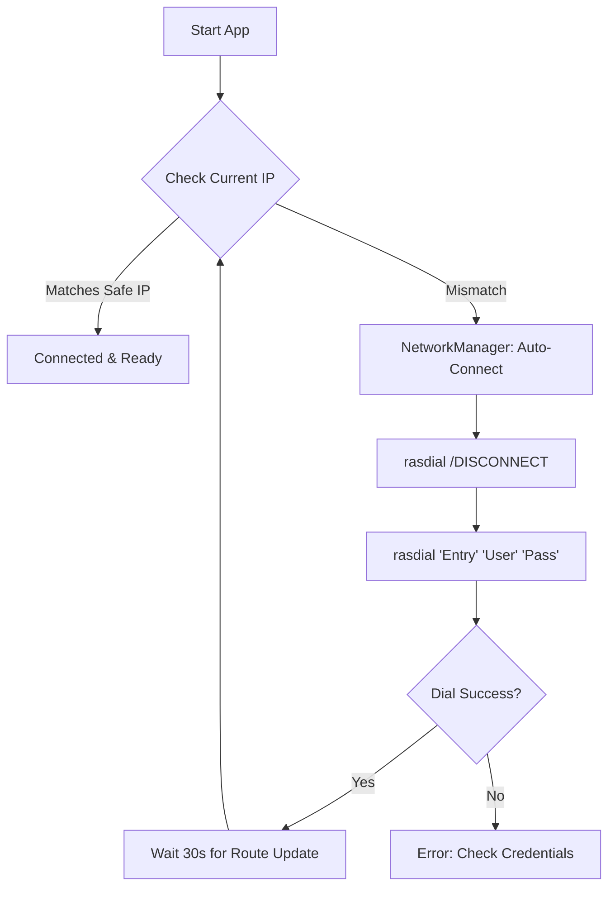

# JoJo Trading Connection Architecture

## 1. Overview ("Why do we need this?")

The **NetworkManager** and **ShioajiConnector** include complex logic for handling PPPoE dial-up connections. This document explains the necessity of this system.

### The Problem: API Security vs. Residential Internet

1. **Strict IP Whitelisting**: The SinoPac Shioaji API (like most trading APIs) enforces strict security. It only accepts connections from IP addresses that have been pre-registered (whitelisted) in your broker account.
2. **Dynamic IPs**: Most residential internet services (e.g., HiNet 光世代) assign **Dynamic IPs** by default. Reboots or 24h disconnects change your IP, causing API calls to be rejected.
3. **The "Fixed IP" Solution**: ISPs often provide a pseudo-Fixed IP service via specific PPPoE credentials (e.g., `xxxx@ip.hinet.net`).

### 2. The Solution: Automated Connection Management

We implemented a robust `NetworkManager` to bridge this gap.

#### Key Functions

* **Auto-Dialing**: Automatically dials the PPPoE connection on startup using stored credentials.
* **IP Verification**: Checks `api.ipify.org` to ensure the current IP matches the Whitelisted IP (`SAFE_IP`).
* **Force Reconnect**: If an IP mismatch is detected (e.g., fallback to dynamic IP), it:
    1. Forcefully disconnects the existing session (`rasdial ... /DISCONNECT`).
    2. Waits for the line to clear.
    3. Re-dials to re-acquire the Fixed IP.

### 3. Necessity Justification

| Factor | Description |
| :--- | :--- |
| **Compliance** | You literally **cannot trade** without the whitelisted IP. It is a hard constraint. |
| **Reliability** | Algorithmic trading often runs 24/7 or unattended. If the internet drops and reconnects to a Dynamic IP, the bot would silently fail without this self-healing mechanism. |
| **UX** | Manual dialing is error-prone. One-click startup ("Fire and Forget") significantly improves the user experience. |

### 4. Technical Flow

