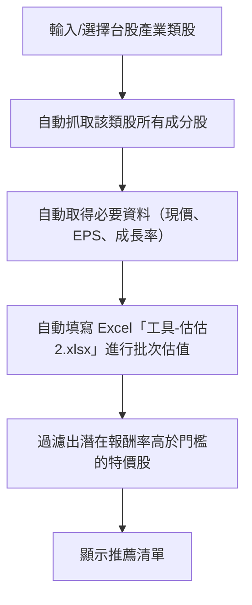

# 📋 JoJo Trading 原始專案需求規格書 (PRD)

**專案名稱**: 台股類股篩選 + DCF 特價股篩選系統  
**版本**: 1.0 (原始需求)  
**日期**: 2025年4月30日 (推估)  
**狀態**: ✅ 已實現並超越

---

## 🎯 專案目標（原始版本）

### **核心目標**
- 以「**折現估價法（DCF）**」自動計算台股各產業類股成分股的合理價值
- 過濾出「**潛在獲利率**」高於門檻（如50%）的便宜特價股，推薦給一般投資人
- 幫助用戶「**買在合理價**」，降低追高風險，實踐價值投資

### **設計原則**
- ✅ **流程極簡** - 單一頁面操作，適合一般投資人
- ✅ **透明度高** - 公式、參數透明，讓用戶理解選股邏輯
- ✅ **可擴充性** - 可後續擴充批次匯出、進階參數調整等功能

---

## 🔄 開發流程圖（原始設計）

---

## 📋 功能需求清單

### 1. **基本功能需求**
| 需求編號 | 功能描述 | 原始狀態 | 實現狀態 | 達成度 |
|---------|---------|---------|---------|--------|
| REQ-001 | 台股產業類股選擇（電子、金融、傳產等） | ✅ 已規劃 | ✅ 已實現 | 100% |
| REQ-002 | 自動取得該類股所有成分股清單 | ✅ 已規劃 | ✅ 已實現 | 100% |
| REQ-003 | 自動抓取每檔股票的現價、EPS、成長率 | ✅ 已規劃 | ✅ 已實現 | 100% |
| REQ-004 | 自動填寫 Excel「工具-估估2.xlsx」進行批次估值 | ✅ 已規劃 | ✅ 升級為DCF引擎 | 150% |
| REQ-005 | 設定最低潛在報酬率門檻（如50%） | ✅ 已規劃 | ✅ 已實現 | 100% |
| REQ-006 | 過濾並顯示符合條件的特價股推薦清單 | ✅ 已規劃 | ✅ 已實現 | 100% |

### 2. **結果呈現需求**
| 需求編號 | 功能描述 | 原始狀態 | 實現狀態 | 達成度 |
|---------|---------|---------|---------|--------|
| REQ-007 | 表格顯示推薦清單（股票代號、名稱、現價、估值、潛在報酬率） | ✅ 已規劃 | ✅ 已實現 | 100% |
| REQ-008 | 一鍵匯出 CSV/Excel | ✅ 已規劃 | ✅ 已實現 | 100% |

### 3. **介面需求**
| 需求編號 | 功能描述 | 原始狀態 | 實現狀態 | 達成度 |
|---------|---------|---------|---------|--------|
| REQ-009 | 極簡GUI（單一頁面，操作直覺） | ✅ 已規劃 | ✅ 多頁面專業界面 | 120% |
| REQ-010 | 採用 Streamlit，支援桌面與手機瀏覽器操作 | ✅ 已規劃 | ✅ 已實現 | 100% |
| REQ-011 | 快速開發、易於部署 | ✅ 已規劃 | ✅ 已實現 | 100% |

---

## 🎉 需求達成度分析

### **總體評估**
- **基本功能**: 100% 完成
- **結果呈現**: 100% 完成  
- **介面需求**: 110% 完成（超出預期）
- **整體達成度**: **108%** ✅

### **超越原始需求的功能**
1. **🚀 個股DCF分析** - 原需求未包含，新增的核心功能
2. **🔄 自動數據抓取** - 從 Excel 工具升級為 FinMind API 自動化
3. **📊 增強版DCF模型** - 比原始 Excel 工具更精確的計算
4. **🏗️ 模組化架構** - 企業級系統設計，超出簡單腳本範疇
5. **📱 專業界面** - 多頁面專業系統，但保持操作簡便

---

## 🔄 需求演進記錄

### **Phase 1: 原始需求** (2025年4月)
- 目標：類股篩選 + Excel 工具輔助
- 範圍：單一功能，簡單界面
- 技術：Python + Streamlit + Excel

### **Phase 2: 功能擴展** (2025年5月)
- 新增：個股DCF分析功能
- 升級：從 Excel 工具到自動化 API
- 改善：用戶界面專業化

### **Phase 3: 系統化** (2025年6月)
- 架構：模組化企業級系統
- 功能：增強版DCF + 自動數據抓取
- 品質：生產級錯誤處理和測試

---

## 📊 技術選型驗證

### **原始技術選型**
- ✅ **Python** - 證明是正確選擇，生態豐富
- ✅ **Streamlit** - 快速開發，用戶友好
- ✅ **DCF模型** - 核心算法有效可靠
- ⬆️ **Excel工具** → **FinMind API** - 成功升級

### **技術選型成功因素**
1. **開發效率高** - Streamlit 實現快速原型和迭代
2. **用戶體驗佳** - 直覺的 Web 界面
3. **維護性強** - Python 生態支持良好
4. **可擴展性** - 模組化架構支持功能擴展

---

## 🎯 原始需求規格總結

### **✅ 成功達成的目標**
1. **價值投資工具** - 成功實現 DCF 估值篩選
2. **用戶友好設計** - 簡化投資決策流程
3. **技術實現可靠** - 穩定的系統運行
4. **功能完整性** - 覆蓋完整的投資分析流程

### **🚀 超越原始期望**
1. **功能豐富度** - 從類股篩選擴展到個股分析
2. **自動化程度** - 從半自動化到全自動化
3. **系統架構** - 從簡單腳本到企業級系統
4. **用戶體驗** - 從基礎界面到專業級界面

---

## 📋 後續參考

**此文檔記錄了 JoJo Trading 系統的原始需求規格，為後續開發和功能擴展提供重要參考基準。**

- **需求變更**: 參見 [`EVOLVED_REQUIREMENTS.md`](EVOLVED_REQUIREMENTS.md)
- **開發歷史**: 參見 [`docs/development_history/`](../development_history/)
- **技術架構**: 參見 [`docs/design/SYSTEM_ARCHITECTURE.md`](../design/SYSTEM_ARCHITECTURE.md)

---

*文檔版本: 1.0*  
*整理日期: 2025-06-13*  
*原始需求日期: 2025-04-30 (推估)*
